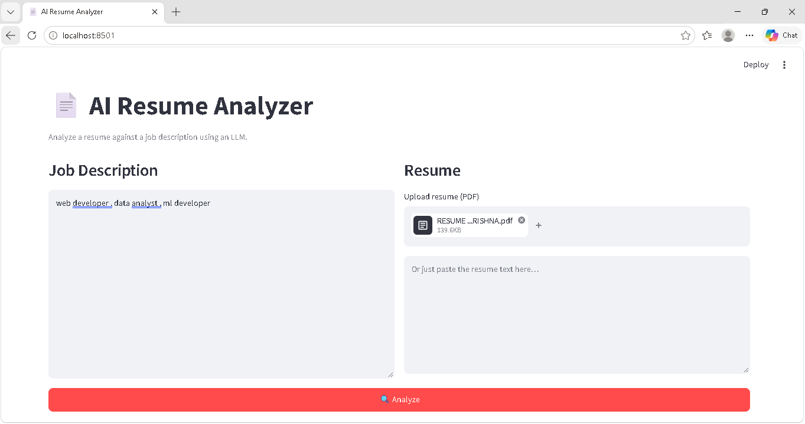

# AI Resume Analyzer

**Name:** Anuj Sharma
**Registration Number:** 23FE10CDS00447
**Branch:** B.Tech Computer Science (Data Science)
**Batch:** Batch F
**GitHub Username:** [anujsharma8504-eng](https://github.com/anujsharma8504-eng)
**Training Program:** NLP Capstone Project — Batch F

---

## 📌 Project Title

**AI Resume Analyzer** — An NLP application that uses a Large Language Model (LLM) via API calls to analyze a resume against a job description and return structured feedback.

---
## 📸 Demo



---


## 🎯 Overview

The tool accepts a job description and a resume (PDF upload or pasted text), sends both to an LLM via an API call, and returns structured, actionable feedback in JSON:

- Match score (0–100)
- Verdict (Strong / Moderate / Weak Match)
- Matching skills
- Missing skills
- Strengths
- Actionable improvements
- Plain-English summary

The LLM is guided by a role-based system prompt and a few-shot example to reliably produce JSON matching a strict schema.

---

## 🏗️ Repository Structure

```
MUJ-DS-23FE10CDS00447/
├── README.md                    ← this file
├── .env.example                 ← API key template
├── .gitignore
│
├── code/                        ← project source code
│   ├── app.py                   ← Streamlit UI
│   ├── config/
│   │   └── config.yaml          ← LLM + app settings
│   ├── prompts/
│   │   └── prompts.yaml         ← all prompt templates
│   ├── src/
│   │   ├── llm_client.py        ← LLM API wrapper with fallbacks
│   │   ├── analyzer.py          ← core analysis logic
│   │   └── utils.py             ← PDF text extraction
│   ├── tests/
│   │   └── test_analyzer.py     ← unit tests (offline)
│   ├── test_api.py              ← quick API test script
│   └── requirements.txt
│
├── capstone/                    ← capstone docs
│   └── README.md
│
├── assignments/                 ← training assignments
├── notebooks/                   ← Jupyter notebooks
├── resources/                   ← reference material
└── presentations/               ← project presentation
```

---

## 🚀 Setup & Run

### 1. Clone the repository

```bash
git clone https://github.com/anujsharma8504-eng/MUJ-DS-23FE10CDS00447.git
cd MUJ-DS-23FE10CDS00447
```

### 2. Create a virtual environment

```bash
python -m venv venv
venv\Scripts\activate          # Windows
# source venv/bin/activate     # macOS / Linux
```

### 3. Install dependencies

```bash
cd code
pip install -r requirements.txt
```

### 4. Add your API key

Copy `.env.example` to `.env` inside `code/` and add your OpenRouter key:

```
OPENROUTER_API_KEY=sk-or-v1-your_key_here
```

Get a free key at **https://openrouter.ai/keys**

### 5. Run the app

```bash
streamlit run app.py
```

Open **http://localhost:8501** in your browser.

---

## 🧠 How the LLM Is Used

1. User provides a job description and a resume (PDF or pasted text)
2. `analyzer.py` loads the prompt template from `prompts/prompts.yaml`
3. The template is filled with the resume text and job description
4. `llm_client.py` sends the request to OpenRouter's OpenAI-compatible API
5. The LLM returns structured JSON matching the enforced schema
6. `analyzer.py` cleans and parses the JSON
7. The Streamlit UI renders the results

**Key features of the LLM integration:**
- Role-based system prompt for persona grounding
- Strict JSON schema enforced in the user prompt
- Few-shot example to teach output format
- Automatic fallback across multiple models
- Retry logic on transient errors (503, rate limits)

---

## ⚙️ Configuration

All tunable settings are in **`code/config/config.yaml`**:

- LLM provider and model
- Fallback models
- Temperature (0.3)
- Max tokens
- App limits (max resume/job chars)

All prompts are in **`code/prompts/prompts.yaml`** — no code changes needed to tune prompts.

---

## 🧪 Tests

```bash
cd code
pytest tests/ -v
```

Tests cover pure logic (JSON cleaning, truncation, input validation) and run offline.

---

## 🛠️ Tech Stack

| Component | Purpose |
|---|---|
| Python 3.10+ | Language |
| Streamlit | Web UI |
| OpenAI Python SDK | Chat completions via OpenRouter |
| PyYAML | Config + prompt files |
| pypdf | PDF text extraction |
| python-dotenv | API key management |
| pytest | Testing |

---

## 📝 Prompt Engineering Notes

- **Role-based system prompt** — "expert technical recruiter" grounds the LLM in a persona
- **Strict JSON schema** enforced for reliable parsing
- **Few-shot example** locks in the output format
- **Low temperature (0.3)** reduces variability
- **Explicit rules** forbid inventing experience and markdown fences

---

## 📜 License

Educational project — free to use and modify.